# Software Developer - Interview Task

# 🎓 Software Implementation Task — Certificate Automation Platform

## 👤 Role

You are a **Software Developer Intern** assigned to develop a prototype of a **digital certificate generation and verification system** for a certification authority. The goal is to modernize their certificate issuing process with automation, digital signing, and fraud-proof verification via blockchain-style UUID and QR-based mechanisms.

---

## 📘 Project Summary

The institute currently issues certificates manually or through limited digital tools. They now want to,

- Upload templates and customize layout of fields (name, program or achievement, date, QR code)
- Bulk-generate certificates from uploaded CSV data
- Digitally sign each certificate
- Embed a QR code with a verifiable UUID
- Export certificates to **PDF**
- After bulk generation
    - Automatically **ZIP** all generated certificates into a single downloadable archive
    - **Merge all PDFs** into a single compiled certificate document (pdf)
    - Upload certificates to a centralized **Google Drive folder**
- Let the public verify a certificate by scanning the QR or visiting a URL like `https:/certificate.roboticgen.co/verify/<uuid>`

Your job is to build a working prototype that supports the above end-to-end workflow.

> Use of AI tools (e.g., ChatGPT, GitHub Copilot) is highly encouraged.
> 
> 
> Be transparent about how they were used by documenting it in your report.
> 

---

## 🧭 System Flow Overview

### 🔄 Main Process

1. **Template Upload**
    
    Institute officers upload a certificate template to the web interface.
    
2. **Position Customization**
    
    Officers visually adjust the position of
    
    - Recipient's name
    - Program name or achievement
    - Issue date
    - QR code placement
3. **Bulk Certificate Generation**
    
    Officers upload a CSV file containing
    
    - `name`, `program`, `issue_date`
4. **For Each Certificate**
    - Generate a **UUID**
    - Create a **QR code** from the UUID with URL
    - Generate the certificate (image)
    - Embed the QR code
    - Export the certificate as **PDF**
    - Digitally **sign the certificate hash**
    - Store `uuid`, `signature`, and metadata for public verification
    - Upload to a **Google Drive folder**
5. **Public Verification**
    
    Anyone can visit URL like`https://certificate.roboticgen.co/verify/<uuid>` to
    
    - View the certificate
    - View certificate metadata
    - Validate authenticity using signature

## Certificate Generation Process

## Certificate Verification Process

```mermaid
graph LR
    A[Scan QR Code or Visit /verify/&lt;uuid&gt;] --> F[Verify Signature using Public Key]
    F --> G{Is Signature Valid?}
    G -- Yes --> H[✅ Certificate is Authentic]
    G -- No --> I[❌ Certificate is Invalid or Tampered]

```

---

## 🛠️ Tech Stack

| Layer | Tech (Preferred) |
| --- | --- |
| Backend | FastAPI (Must be a python based) |
| Frontend | Next.js + Tailwind (or Shadcn UI) |
| PDF/Image Gen | Pillow (PIL) |
| Digital Signing | `cryptography` |
| QR Codes | `qrcode` |
| Google Drive API | `pydrive` or relevant |
| Storage | SQLite |

---

## 🎯 Core Requirements

### 🔹 Backend

- Template upload & processing API
- CSV parsing and certificate generation logic
- Digital signing and UUID generation
- Google Drive integration
- API for UUID-based certificate verification

### 🔹 Frontend

- Template uploader
- Certificate field position editor (drag and drop or pixel input)
- CSV upload interface
- List of generated certificates + status
- Verification page (QR redirects here)

### 🔹 Certificate Generator (Python Core)

- Generates high-resolution PNG + PDF
- Embeds name, program, date, QR
- Generates deterministic UUID
- Signs using  private key
- Stores final outputs and metadata

---

## 📦 Expected Deliverables

### 🔹 Source Code

- Backend + Frontend
- Certificate generation engine
- Digital signing and verification logic

### 🔹 Demo

- Ability to upload a template, CSV, and generate downloadable certificates
- QR code pointing to a live verification page
- Working verification page (valid or tampered)

### 🔹 Documentation

- `README.md` for backend, frontend, certificate module
- DB record format
- `report.md` or `.pdf`:
    - Time spent
    - AI usage summary
    - Issues faced + resolutions
    - Bonus features added

<aside>
💡

Function Prototypes for the Certificate generation,Digital Signing has been given in the repository

You may change or update any provided code snippets for better functionality or readability.

</aside>

---

## ✅ Evaluation Criteria

| Component | Criteria |
| --- | --- |
| Generator | Layout customization |
| QR + Signature | Proper embedding and signature verification |
| Frontend | Clean UI for both issuer and verifier |
| Backend | Modular, secure, well-documented |
| Documentation | Setup clarity, architecture, AI usage notes |
| Extra Features | Google Drive upload, verification API, styling |
| Best Practices | Secure key handling, clean file I/O |

---

## 🧪 Dummy Data

Use `people.csv`

[people](https://www.notion.so/1e9bda01018c81aeaacdcb47fe0babff?pvs=21)

### Sample certificate template

> Insert QR code in appropriate position
> 

### Logo

 

---

## 🔗 Set up Project

Use the following GitHub Classroom link to access the starter repository:

👉 [https://classroom.github.com/a/gPn4VcDz](https://classroom.github.com/a/gPn4VcDz)

- Clone the repository
- Complete your implementation in the given structure
- Push your final code before the deadline

---

## 📅 Deadlines

| Type | Date |
| --- | --- |
| Soft Deadline | 2025-05-08 11.59 P.M. |
| Hard Deadline | 2025-05-10 11.59 P.M. |

> Submissions after the hard deadline will not be reviewed
> 

---

## 📬 Contact

📧 dev@roboticgen.co